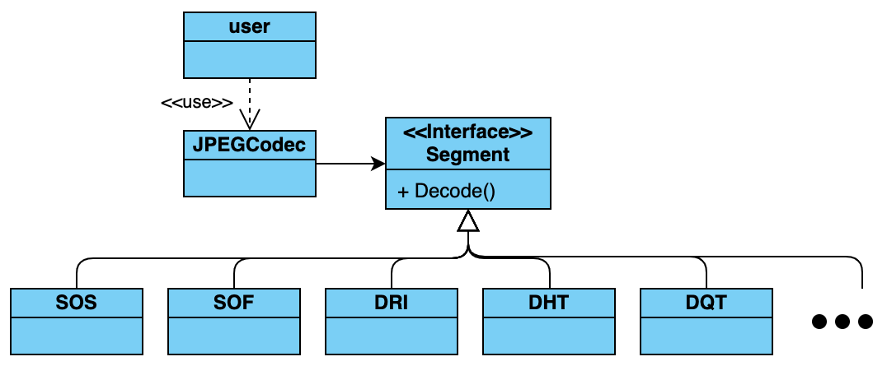

## 說明
本程式用以將 jpeg 圖檔解碼，並轉換為 bmp 圖檔儲存，僅支援 sequential DCT-based 壓縮模式。其編程語言為 c++ ，其程式結構主要由 `main`, `JPEGCodec`, `segment` (所有 jpeg segment 皆繼承此 class) 構成。簡易版的 class diagram 如下圖。

`code` 資料夾中，有本程式的原始碼。`image` 資料夾中，有測試時所使用的 jpeg 圖檔，以及轉換後的 bmp 圖檔。
## 環境
在 macOS Mojave 10.14.5 版本的電腦上執行。
g++ 編譯器版本資訊如下: (`g++ -v`)
```
Configured with: --prefix=/Library/Developer/CommandLineTools/usr --with-gxx-include-dir=/Library/Developer/CommandLineTools/SDKs/MacOSX10.14.sdk/usr/include/c++/4.2.1
Apple LLVM version 10.0.1 (clang-1001.0.46.4)
Target: x86_64-apple-darwin18.6.0
Thread model: posix
InstalledDir: /Library/Developer/CommandLineTools/usr/bin
```
編譯時使用 make 指令，其版本資訊為: (`make -v`)
```
GNU Make 3.81
Copyright (C) 2006  Free Software Foundation, Inc.
This is free software; see the source for copying conditions.
There is NO warranty; not even for MERCHANTABILITY or FITNESS FOR A
PARTICULAR PURPOSE.

This program built for i386-apple-darwin11.3.0
```
## 編譯
在 `code` 資料夾中，執行以下指令
```
make
```
即會產生 `main` 執行檔。

## 執行
此程式執行方式有以下兩種：
1. 一次將一個以上的 jpeg 圖檔轉換為 bmp 圖檔。（儲存於與 jpeg 圖檔相同路徑下）
```
./main IMAGE_1 [IMAGE_2 ...]
```
2. 直接執行程式，會進入互動介面。互動介面包含4個指令，分別為 `read`, `read2`, `displayMCU`, `exit`，提供使用者轉檔、顯示特定 MCU 資訊以及結束程式。
```
./main
```
